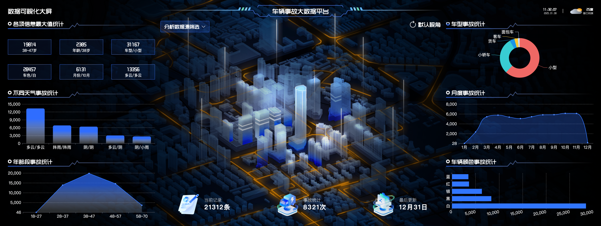
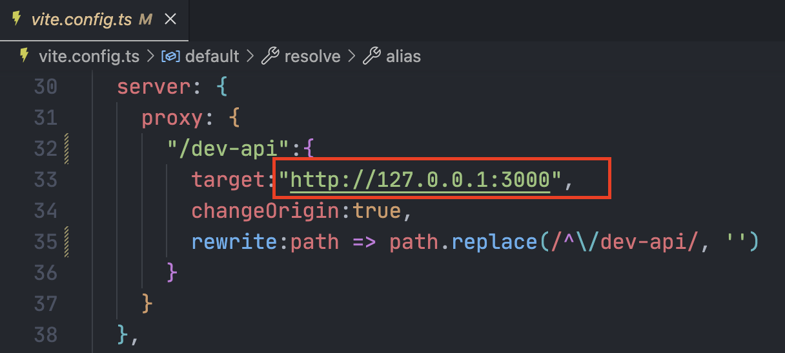

# 车辆事故大数据平台
该平台是一个基于 Vue3、Vite、TypeScript 技术栈的可视化大屏，旨在展示并分析车辆事故相关的数据。该平台能够动态呈现包括天气、年龄段、车型、车颜色等多维度的车辆事故数据。




## 前端技术选型
- Vue3 + TS + Vite
- Echarts、Axios、Pinia、Scss


## 项目部署
运行该项目前，需要先部署后端服务器，项目地址：[https://gitee.com/maxiangqian/carflow](https://gitee.com/maxiangqian/carflow)

1. 安装依赖（需要安装node环境）
```
npm install
```
2. 配置 `vite.config.ts` 代理服务器地址

3. 运行项目
```
npm run dev
```


## 窗口适配方案
vw-vh方案 ✅
- 页面展示效果好。
- 当屏幕比例跟 ui 稿不一致时，不会出现两边留白情况。
- 像素单位换算比较蛮烦，图表都需要单独做字体、间距、位移的适配

## 获取数据的方式
1. WebSocket ❌
    - 实时性高，适合股票类对实时性要求高的场景
    - 对服务器资源消耗大
2. Http轮询 ❌
    - 实现简单，缺点即使数据没有更新，也会频繁的请求服务器，浪费服务器资源。
3. SSE ✅
    - Server-Sent Event，服务器推送事件
    - 适合实时性要求不高的场景，可以节省服务器资源
    - 由于是单向的，它的开销相对较低，特别适合需要频繁从服务器推送数据的应用
4. Http + SSE ✅
    - 首次加载时，使用http获取数据。
    - 后续图表数据更新，通过SSE由服务器主动推送到客户端（减少不必要的http请求，节省服务器的负担）。


## 项目结构简介

### `src`目录结构
```
├── main.ts  ## 入口文件
├── App.vue  ## 根组件
├── api # 接口请求
├── assets # 静态资源
├── components # 公共组件
├── echarts # echarts库和公共配置项
├── store # pinia状态管理
├── styles # 公共样式
├── utils # 工具函数
└── vite-env.d.ts # 类型声明文件
```

### 项目环境变量
- `.env` 全局环境变量
- `.env.development` 开发环境变量
- `.env.production` 生产环境变量
  

### 窗口适配 css和js
1. `src/styles/px2v.scss` px单位转vw单位 (全局配置)
2. `src/utils/px2v.ts` px单位转vw单位
3. `src/utils/chartSize.ts` 用于计算图表尺寸


### 组件介绍
1. `src/main.ts` 入口文件
2. `src/App.vue` 根组件
3. `src/components/BlackLayer.vue` 背景组件
4. `src/components/Header/index.vue` 导航栏组件
5. `src/components/Main.vue` 主要内容组件
6. `src/components/Center/***.vue` 中间区域的组件（略）
7. `src/components/ChartFrame/index.vue` 图表框组件
8. `src/components/ChartList/***.vue` 图表组件


### API接口封装
1. `vite-config.ts` 启动开发代理服务器
2. `src/utils/request.ts` 封装axios请求
3. `src/api/index.ts` 统一管理接口请求
4. `src/api/types.ts` 接口请求参数类型声明


### 状态管理
1. `src/store/index.ts` 图表数据状态管理

### 图表组件
1. `src/echarts/*` echart库和公共配置项
2. `src/components/ChartList/*` 图表组件
3. `src/components/Main.vue` 图表自适应处理